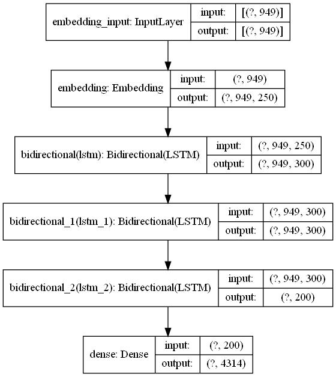

# Unsupervised-word-based-text-generation
Neural network model generates text similar to the files given in the data.

# Report for Hw3 Unsupervised Learning

# Objective:
To generate text (new ideas) based on the files provided.

For example: the files include the data in following format:

```
== SOURCE
https://www.nature.com/articles/d41586-021-02556-w
== AGENT
Bastani et al., Nature
== GOAL
In Greece, create an algorithm for testing with a balance between the need for testing people arriving at borders for COVID-19 and the need for travel between countries in an economy which relies on tourism by selectively testing those who are most likely to have COVID-19.
== DATA
Previous samples of populations with and without COVID-19 along with continously updating the data it has available with the newly tested people arriving in the country.
== METHODS
Reinforcment learning and exploring unknown patterns to see the results of testing those patterns.
== RESULTS
The automated system doubled the efficiency of testing
== ISSUES
The testing is currently limited to the data the algorithm has available to it by GDPR, perhaps for the better. The algorithm could cause displeasure in the groups who it identifies as more likely to test positive for the virus but who still test negative. The algorithm also only tests for a positive result and not the virus itself, meaning it could be subject to a disproportionate ammount of false positives.
== SCORE
7
== COMMENTS
The real world application of this machine learning algorithm is fascinating, and the results seem impressive with it being able to correctly guess who would test positive twice as much as how Greece selected for tests prior to the alogrithm's implimentation. It does raise ethical concerns as it is selecting people to have an intrusive test done on them from a profile about them however.
```
## Note:
**For the purposes of efficiency, I'll only be choosing the 'GOALS' for each file.**

# Extraction of Data:
I have used only 800 text files for training purposes due to hardware limit on my computer.

From each text file, I've extracted only the 'GOAL'

```
data_path = "data"
data_file_names = os.listdir(path=data_path)

corpus = []

for i in range(len(data_file_names)):
    full_path = os.path.join(data_path,data_file_names[i])
    try:
        corpus.append(open(full_path).read()[open(full_path,'r').read().find('GOAL') + 4:open(full_path,'r').read().find('== DATA')].replace('\n',''))
    except:
        pass

# Minimizing corpus size:
corpus = corpus[:800]
```

# Model:
I have use a Bidirectional LSTM network for the purposes of generating new text.
```
# Creating model
model = tf.keras.models.Sequential()
model.add(Embedding(input_dim=total_words, output_dim=250, input_length=max_sequence_len - 1))
model.add(Bidirectional(LSTM(150,return_sequences=True)))
model.add(Bidirectional(LSTM(150,return_sequences=True)))
model.add(Bidirectional(LSTM(100)))
model.add(Dense(total_words, activation='softmax'))

model.compile(loss='categorical_crossentropy', optimizer='adam')
```



# Post Fitting models
I trained the model for 126 epochs, with each epoch taking 4 minutes to complete.

# Results:

I created a function where the model will predict the occurring words after the given seed text.
```
def generate_text(seed_text,next_words,model):
    for _ in range(next_words):
        token_list = tokenizer.texts_to_sequences([seed_text])[0]
        token_list = pad_sequences([token_list], maxlen=max_sequence_len - 1, padding='pre')
        predicted = model.predict_classes(token_list, verbose=0)
        output_word = ""
        for word, index in tokenizer.word_index.items():
            if index == predicted:
                output_word = word
                break
        seed_text += ' ' + output_word
    return seed_text
```

## Few Outputs.
### 1.
```
generate_text("B",40,model_1)
```


'B maps aims to predict when and where traffic jams will occur and allow its user to avoid them and find the shortest route to their destination attack as high target data dimensions—data came in the public during the development of'


### 2.
```
generate_text('Great',30,model_1)
```


"Great intelligent technologies to analyze natural language patterns to discern degrees of loneliness in older adults circuits dystrophy in layman's terms use machine learning to discover new sequences to boost drug"


### 3.
```
generate_text('AI',70,model_1)
```

'AI to play quake 3 arena capute the flag which are searching for a hotel to book cancerous mutations in non unique parts of the genome throughput manner if they find an stimulate the world all the global scale and some will develop human non image privacy in the traditional learning they was emitting the world have them on a cancer i e by asking alexa to play the name of'


# Conclusion:
**Although these "new Ideas" are fun to read, the model has read through the files and is now able to generate new ideas ('GOAL') with less grammatical errors.**
