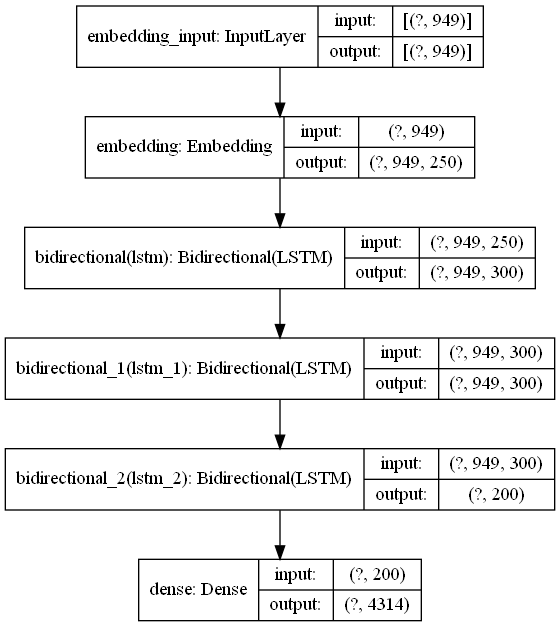

# Report for Hw3 Unsupervised Learning

# Objective:
To generate text (new ideas) based on the files provided.

# Extraction of Data:
I have used only 800 text files for training purposes due to hardware limit on my computer.

From each text file, I've extracted only the 'GOAL'

```
data_path = "data"
data_file_names = os.listdir(path=data_path)

corpus = []

for i in range(len(data_file_names)):
    full_path = os.path.join(data_path,data_file_names[i])
    try:
        corpus.append(open(full_path).read()[open(full_path,'r').read().find('GOAL') + 4:open(full_path,'r').read().find('== DATA')].replace('\n',''))
    except:
        pass

# Minimizing corpus size:
corpus = corpus[:800]
```

# Model:
I have use a Bidirectional LSTM network for the purposes of generating new text.
```
# Creating model
model = tf.keras.models.Sequential()
model.add(Embedding(input_dim=total_words, output_dim=250, input_length=max_sequence_len - 1))
model.add(Bidirectional(LSTM(150,return_sequences=True)))
model.add(Bidirectional(LSTM(150,return_sequences=True)))
model.add(Bidirectional(LSTM(100)))
model.add(Dense(total_words, activation='softmax'))

model.compile(loss='categorical_crossentropy', optimizer='adam')
```



# Post Fitting models
I trained the model for 126 epochs, with each epoch taking 4 minutes to complete.

# Results:

I created a function where the model will predict the occurring words after the given seed text.
```
def generate_text(seed_text,next_words,model):
    for _ in range(next_words):
        token_list = tokenizer.texts_to_sequences([seed_text])[0]
        token_list = pad_sequences([token_list], maxlen=max_sequence_len - 1, padding='pre')
        predicted = model.predict_classes(token_list, verbose=0)
        output_word = ""
        for word, index in tokenizer.word_index.items():
            if index == predicted:
                output_word = word
                break
        seed_text += ' ' + output_word
    return seed_text
```

## Few Outputs.
### 1.
```
generate_text("B",40,model_1)
```


'B maps aims to predict when and where traffic jams will occur and allow its user to avoid them and find the shortest route to their destination attack as high target data dimensions—data came in the public during the development of'


### 2.
```
generate_text('Great',30,model_1)
```


"Great intelligent technologies to analyze natural language patterns to discern degrees of loneliness in older adults circuits dystrophy in layman's terms use machine learning to discover new sequences to boost drug"


### 3.
```
generate_text('AI',70,model_1)
```

'AI to play quake 3 arena capute the flag which are searching for a hotel to book cancerous mutations in non unique parts of the genome throughput manner if they find an stimulate the world all the global scale and some will develop human non image privacy in the traditional learning they was emitting the world have them on a cancer i e by asking alexa to play the name of'


**Although these "new Ideas" are fun to read, the model has read through the files and is now able to generate new ideas ('GOAL') with less grammatical errors.
**
